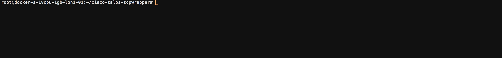
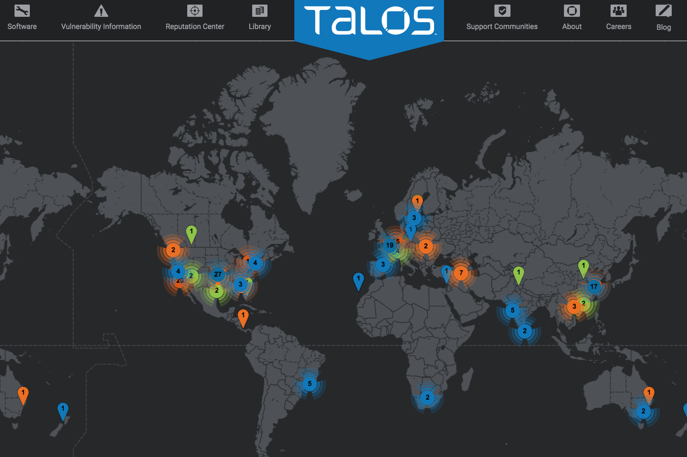

# cisco-talos-tcpwrapper

## Demo

Sync your **/etc.hosts.deny** with Cisco Talos IP Blacklist



## About Talos

Talos is Cisco’s industry-leading threat intelligence team that protects your organization’s people, data and infrastructure from active adversaries. The Talos team collects information about existing and developing threats, and provides comprehensive protection against more attacks and malware than anyone else. All Cisco Security products utilize Talos threat intelligence, providing fast and effective security solutions. Our job is protecting your network. https://www.talosintelligence.com/



## About cisco-talos-tcpwrapper

This script downloads the Cisco Talos IP Blacklist (https://www.talosintelligence.com/documents/ip-blacklist).  
Then adds it to **/etc/hosts.deny** as an included file.  
It runs every 1 hour and updates the **/etc/cisco-talos-tcpwrapper/cisco-talos-ip-blacklist** file with the current up-to-date list.

## Getting Started

#### Run the first time with Docker as test (--rm flag for removal after exit)
```
docker run -it --rm \
-v /etc/hosts.deny:/go/src/cisco-talos-tcpwrapper/hosts.deny \
-v /etc/cisco-talos-tcpwrapper/:/go/src/cisco-talos-tcpwrapper/cisco-talos-tcpwrapper/ \
robertcsapo/cisco-talos-tcpwrapper:latest
```

#### Running it as daemon (--restart flag makes it restart if stopped manually)
```
docker run -d \
-v /etc/hosts.deny:/go/src/cisco-talos-tcpwrapper/hosts.deny \
-v /etc/cisco-talos-tcpwrapper/:/go/src/cisco-talos-tcpwrapper/cisco-talos-tcpwrapper/ \
--restart=on-failure \
robertcsapo/cisco-talos-tcpwrapper:latest
```

#### Running it with Docker Compose
```
docker-compose up -d
```

#### Build from scratch
```
git clone https://github.com/robertcsapo/cisco-talos-tcpwrapper
cd cisco-talos-tcpwrapper/
docker build -t robertcsapo/cisco-talos-tcpwrapper:latest .
```
## Customize

```
Cisco Talos tcpwrapper command-line to override settings

Flags:
  -h, --help         Show context-sensitive help (also try --help-long and --help-man).
      --debug        Enable debug mode
      --url=URL      Change URL for Cisco Talos IP Blacklist
      --sleep=SLEEP  Change sleep timer between downloads of the list
      --version      Show application version.
```
